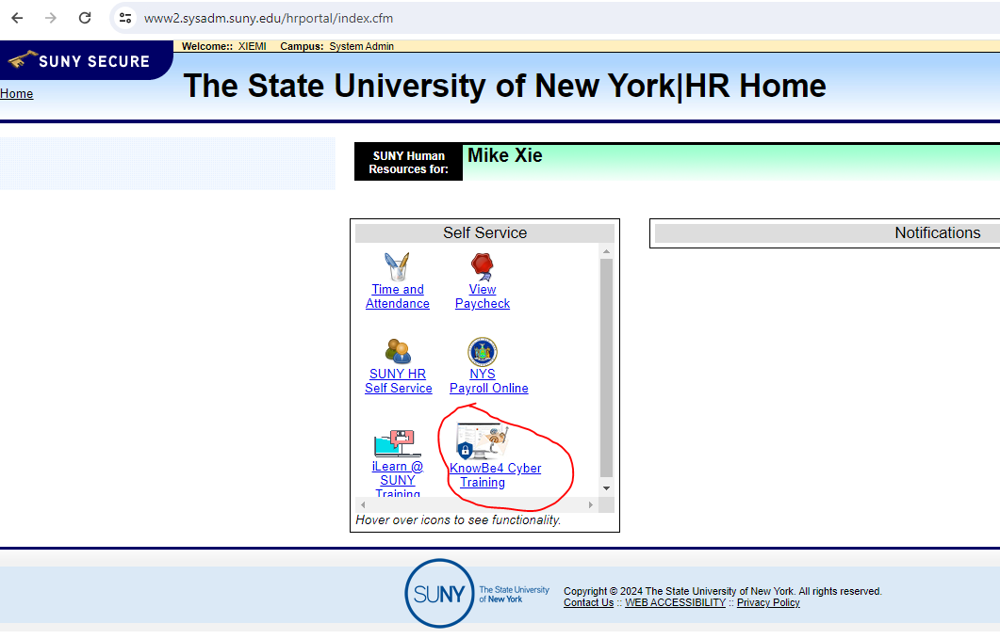

# Security Training

Security is paramount in our software project to protect sensitive data, prevent unauthorized access, and mitigate potential security threats. This document outlines the security training that all members must do.

## How to do the security training

- Go to the hr portal
- Click on **KnowBe4 Cyber Training**
  - 
- Login with your SUNY email
- Do all the necessary assignments and training.
  - Watch the videos
  - Do the quiz
  - Play the **Spot the Phish Game**
    - Spot the Phish Game can be really hard for non technical people

## Random Security Phishing Tests

You might get random emails in your SUNY inbox that look like phishing emails.
Ignore or report these phishing emails.

## other stuff

To do
